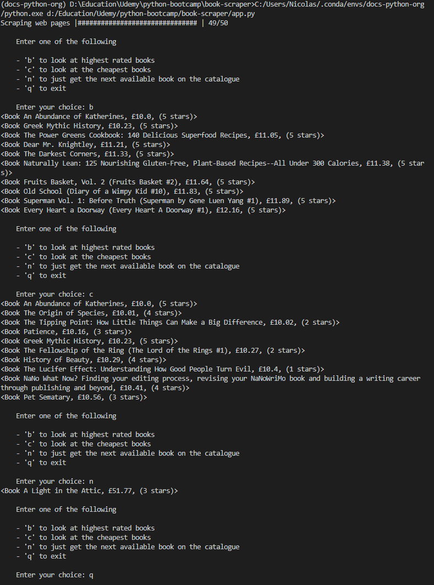

# Book Scraper

## Table of Contents
- [Introduction](#introduction)
- [Features](#features)
- [Screenshots](#screenshots)
- [Setup](#setup)
- [Technologies](#technologies)

## Introduction
Book Scraper is a python application that scrapes the web page at http://books.toscrape.com.

The purpose of this application was to become more familiar with web scraping.

## Features
- Scrapes the web page http://books.toscrape.com

## Screenshots


## Setup
To run, in the console enter:
```
python app.py
```

## Technologies
- [Python 3.8.3](https://www.python.org/downloads/release/python-383/)
### Python Modules
- [BeautifulSoup4](https://pypi.org/project/beautifulsoup4/)
    - Allows a web page to be scraped (parses its HTML or XML)
- [requests](https://pypi.org/project/requests/)
    - Allows sending HTTP requests
