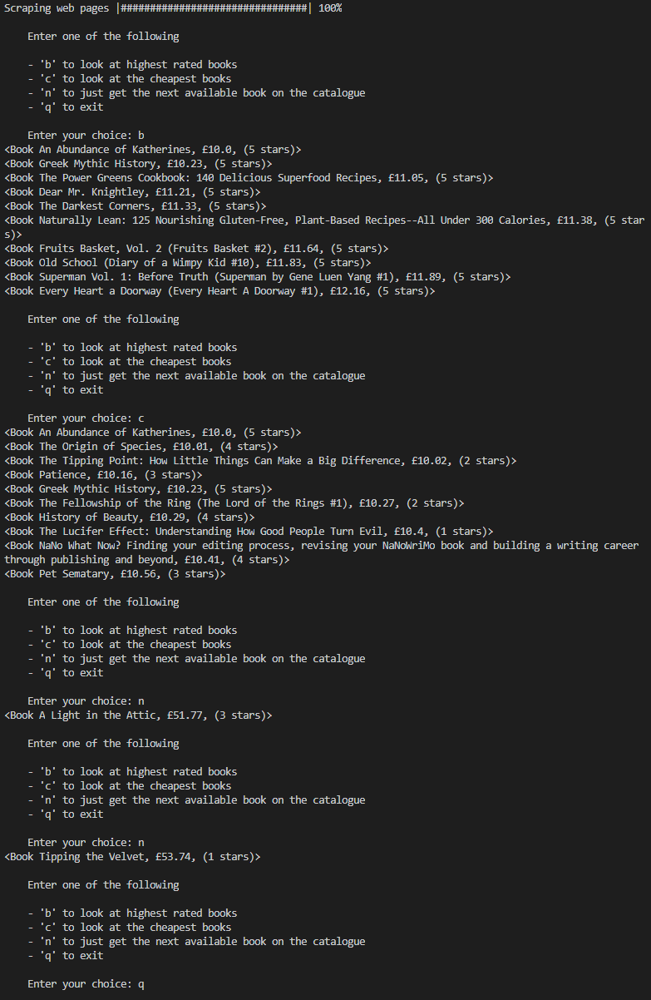

# Book Scraper

## Table of Contents
- [Introduction](#introduction)
- [Features](#features)
- [Screenshots](#screenshots)
- [Setup](#setup)
- [Technologies](#technologies)

## Introduction
Book Scraper is a python application that scrapes the book catalogue website, http://books.toscrape.com. It then allows you to look at the data related to books on the different pages of the website.

The purpose of this application was to become more familiar with web scraping.

## Features
- Scrapes the web site: http://books.toscrape.com
- Console menu with the options:
    - Look at highest rated books
    - Look at cheapest books
    - Get next available book in catalogue
    - Exit menu
- Console menu also has a progress bar

## Screenshots
### Screenshot of Booke Catalogue Website


### Screenshot of Console Menu


## Setup
To run, in the console enter:
```
python app.py
```

## Technologies
- [Python 3.8.3](https://www.python.org/downloads/release/python-383/)
### Python Modules
- [BeautifulSoup4](https://pypi.org/project/beautifulsoup4/)
    - Allows a web page to be scraped (parses its HTML or XML)
- [requests](https://pypi.org/project/requests/)
    - Allows sending HTTP requests
